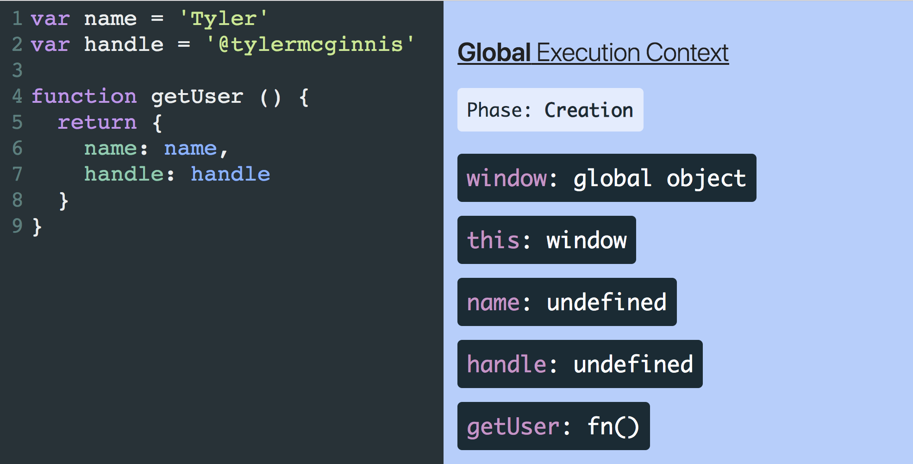

#### Global Execution Context

Initially, this Execution Context will consist of two things - a global object and a variable called `this`. `this` will reference the global object which will be `window` if you’re running JavaScript in the browser or `global` if you’re running it in a Node environment.

Each Execution Context has two separate phases, a `Creation` phase, and an `Execution` phase and each phase has its own unique responsibilities.

In the Global `Creation` phase, the JavaScript engine will

1. Create a global object.
2. Create an object called “this”.
3. Set up memory space for variables and functions.
4. Assign variable declarations a default value of “undefined” while placing any function declarations in memory.

#### Function Execution Context