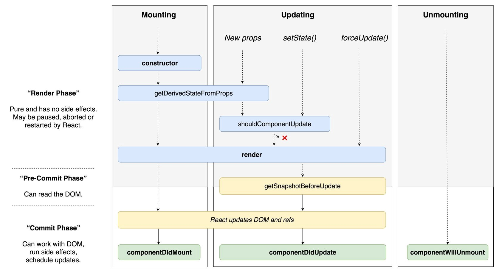

React 学习笔记

[TOC]

React 官方文档 https://reactjs.org/docs/getting-started.html 

#### React 基础

##### React 基本特性

1. 一个新概念：component
2. 四个必知 API：
   1. ReactDOM.render 方法让 React 组件渲染到某个具体的 DOM 节点
   2. 组件的 render 方法
   3. 组件的 setState 方法，用于改变组件状态，触发 render
   4. 如何通过 props 给 React 组件传递参数
3. 单向数据流：Flux
4. 完善的错误提示

##### React 组件

1. React 组件一般不提供方法，而是某种状态机
2. React 组件可以理解为一个纯函数
3. 单向数据绑定

- ###### 受控组件

  表单元素状态由使用者维护

- ###### 非受控组件

  表单元素状态 DOM 自身维护

- ###### 创建组件原则：DRY(DON’T REPEAT YOURSELF)

  - 每个组件只做一件事
  - 如果组件变得复杂，应该拆分成小组件

- ###### 数据状态管理

  - 能计算得到的状态不要单独存储
  - 组件尽量无状态，所叙述句通过 props 获取

- ###### 生命周期 http://projects.wojtekmaj.pl/react-lifecycle-methods-diagram/

  

  - constructor
    1. 用于初始化内部状态，很少使用
    2. 唯一可以直接修改 state 的地方
  - getDerivedStateFromProps(v16.3)
    1. 当 state 需要从 props 初始化时使用
    2. 尽量不要使用：维护两者状态一致性会增加复杂度
    3. 每次 render 都会调用
    4. 典型场景：表单控件获取默认值
  - componentDidMount
    1. UI 渲染完成后调用
    2. 只执行一次
    3. 典型场景：获取外部资源
  - componentWillUnmount
    1. 组件移出时被调用
    2. 调性场景：资源释放
  - getSnapshotBeforeUpdate
    1. 在页面 render 之前调用，state 已经更新
    2. 典型场景：获取 render 之前的 DOM 状态
    3. 返回值为 componentDidUpdate 的第三个参数
  - componentDidUpdate
    1. 每次 UI 更新时被调用
    2. 典型场景：页面需要根据 props 变化重新获取数据
  - shouldComponentUpdate
    1. 决定 Virtual DOM 是否要重绘
    2. 一般可以由 PureComponent 自动实现
    3. 典型场景：性能优化

##### JSX

###### 运行基础

Virtual DOM

###### 本质

###### 如何使用

###### JSX 的优点

###### 约定

1. React 认为小写的 tag 是原生 DOM 节点， 如 div
2. 大写字母开头为自定义组件
3. JSX 标记可以直接使用属性语法，例如\<menu.item\>

##### Virtual DOM

1. 广度优先分层比较

2. 节点跨层移动
3. 算法复杂度 O(n)
4. 虚拟 DOM 如何计算 diff
5. key 属性的作用

##### 组件设计模式：高阶组件(High Order Component)和函数作为子组件(Render Props)

- HOC

  高阶组件接受组件作为参数，返回新的组件

- Render Props

##### Context API

- 组件间通信, React.createContext()
- Provider
- Comsumer

##### 脚手架

Create React App: https://github.com/facebook/create-react-app

Rekit: http://rekit.js.org

Codesandbox: https://codesandbox.io