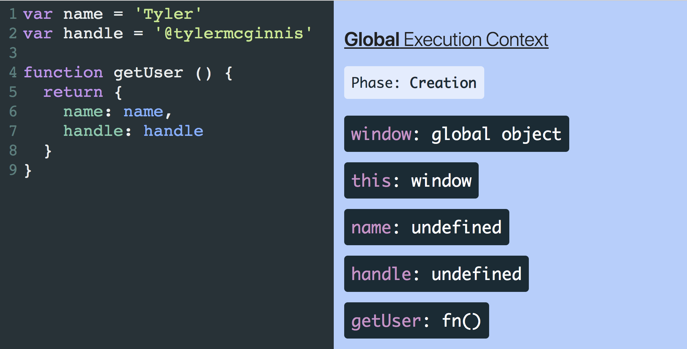
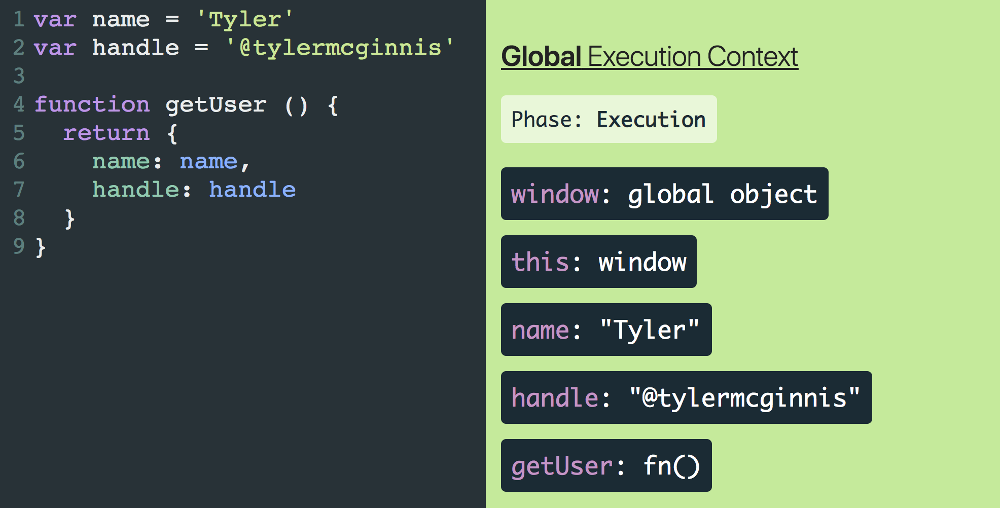

## The Ultimate Guide to Execution Contexts, Hoisting, Scopes, and Closures in JavaScript

### 1. Execution Context

**Execution Contexts** allow the JavaScript engine to manage the complexity of interpreting and running your code. 

#### 1.1 Global Execution Context

##### 1.1.1 How do the Execution Context get created and what do they consist of?

Execution Context consist of two things - **a global object** and a variable called `this`

 `this` will reference the global object which will be `window` if you’re running JavaScript in the browser 

​                                                                                      or `global` if you’re running it in a Node environment.

```javascript
this === window // true, in browser
this === global // true, in Node Environment
```

##### 1.1.2 Two phases: `Creation` phase and `Execution` phase

| Creation Phase                                               | Execution Phase                                              |
| :----------------------------------------------------------- | :----------------------------------------------------------- |
|  |              |
| 1. Create a global object(window or global). <br />2. Create an object called “this”. <br />3. Set up memory space for variables and functions. <br />4. Assign variable declarations a default value of “undefined” while placing any function declarations in memory. | It's not until the `Execution` phase where the JavaScript engine starts running your code line by line and executing it. And assign the real values to the variables already living in memory. |

[JavaScript Visualizer](https://tylermcginnis.com/javascript-visualizer) 


#### 1.2 Function Execution Context

It’s created whenever a function is **invoked**.

##### **What’s the difference between the Global Execution Context and a Function Execution Context.**

| Global Execution Context                                     | Function Execution Context                                   |
| :----------------------------------------------------------- | :----------------------------------------------------------- |
| 1. Create a global object. <br />2. Create an object called “this”. <br />3. Set up memory space for variables and functions. <br />4. Assign variable declarations a default value of “undefined” while placing any function declarations in memory. | 1. Create a global object. (Doesn’t include this item)<br /><br />1. Create an arguments object.<br />2. Create an object called this.<br />3. Set up memory space for variables and functions.<br />4. Assign variable declarations a default value of “undefined” while placing any function declarations in memory. |

[Visualize the code yourself](https://tylermcginnis.com/javascript-visualizer/?code=var name %3D 'Tyler' var handle %3D '%40tylermcginnis' function getUser () {  return {    name%3A name%2C    handle%3A handle  } } getUser())


### 2. Hoisting

The process of assigning variable declarations a default value of `undefined` during the creation phase is called **Hoisting**.

### 3. Scopes

Scope is The current context of execution.

This process of the JavaScript engine going one by one and checking each individual parent Execution Context if a variable doesn’t exist in the local Execution Context is called the `Scope Chain`. 

Any child Execution Context can reference any variables located in any of its parent Execution Contexts, but not vice versa.

### 4. Closures


[Visualize the code yourself](https://tylermcginnis.com/javascript-visualizer/?code=var count %3D 0 function makeAdder(x) {  return function inner (y) {    return x %2B y%3B  }%3B } var add5 %3D makeAdder(5)%3B count %2B%3D add5(2))

Notice that after the `makeAdder` Execution Context has been popped off the Execution Stack, JavaScript Visualizer creates what’s called a `Closure Scope`. Inside of that `Closure Scope` is the same variable environment that existed in the `makeAdder` Execution Context. The reason this happened is because we have a function nested inside of another function. In our example, the `inner` function is nested inside of the `makeAdder` function, so `inner` creates a `Closure` over the `makeAdder` variable environment. Even after the `makeAdder` Execution Environment has been popped off the Execution Stack, because that `Closure Scope` was created, `inner` has access to the `x` variable (via the Scope Chain).

As you probably guessed, this concept of a child function “closing” over the variable environment of its parent function is called `Closures`.

#### X. Global Variables

In the browser, anytime you create a variable in the Global Execution Context (outside of any function), that variable will be added as a property on the `window` object.

In both the browser and in Node, if you create a variable without a declaration (ie without `var`, `let`, or `const`), that variable will also be added as a property on the global object.

```js
// In the browser
var name = 'Tyler'

function foo () {
  bar = 'Created in foo without declaration'
}

foo()

console.log(window.name) // Tyler
console.log(window.bar) // Created in foo without declaration
```

