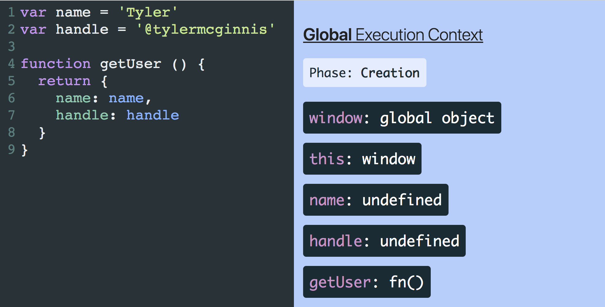
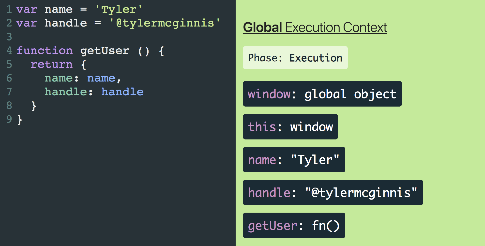

## (Bonus) Execution Context, Scopes, and Closures

> This is originally part of our Advanced JavaScript course. However, it’s applicable to us here as well.

It may seem surprising, but in my opinion the most important and fundamental concept to understanding the JavaScript language is understanding Execution Context. By properly learning it, you’ll be positioned nicely to learn more advanced topics like hoisting, scope chains, and closures. With that in mind, what exactly is an “Execution Context”? To better understand it, let’s first take a look at how we write software.

One strategy for writing software is to break our code up into separate pieces. Though these “pieces” have many different names (functions, modules, packages, etc), they all exist for a single purpose - to break apart and manage the complexity in our applications. Now instead of thinking like someone *authoring* code, think in terms of the JavaScript engine whose job is to *interpret* code. Can we use that same strategy, separating code into pieces, to manage the complexity of interpreting code just like we did in order to write it? Turns out we can and these “pieces” are called Execution Contexts. **Just like functions/modules/packages allow you to manage the complexity of writing code, Execution Contexts allow the JavaScript engine to manage the complexity of interpreting and running your code.** So now that we know the purpose of Execution Contexts, the next questions we need to answer are how do they get created and what do they consist of?

The first Execution Context that gets created when the JavaScript engine runs your code is called the “Global Execution Context”. Initially this Execution Context will consist of two things - a global object and a variable called `this`. `this` will reference the global object which will be `window` if you’re running JavaScript in the browser or `global` if you’re running it in a Node environment.


Above we can see that even without any code, the Global Execution Context will still consist of two things - `window` and `this`. This is the Global Execution Context in its most basic form.

Let’s step things up and see what happens when we start actually adding code to our program. Let’s start with adding a few variables.





Can you spot the differences between those two image above? The key take away is that each Execution Context has two separate phases, a `Creation` phase and an `Execution` phase and each phase has its own unique responsibilities.

In the Global `Creation` phase, the JavaScript engine will

1. Create a global object.
2. Create an object called “this”.
3. Set up memory space for variables and functions.
4. Assign variable declarations a default value of “undefined” while placing any function declarations in memory.

It’s not until the `Execution` phase where the JavaScript engine starts running your code line by line and executing it.

We can see this flow from `Creation` phase to `Execution` phase in the GIF below.


During the `Creation` phase, `window` and `this` are created, variable declarations (`name` and `handle`) are assigned a default value of `undefined`, and any function declarations (`getUser`) are placed entirely into memory. Then once we enter the `Execution` phase, the JavaScript engine starts executing the code line by line and assigns the real values to the variables already living in memory.

> GIFs are cool, but not as cool as stepping through the code and seeing the process for yourself. Because you deserve it, I created [JavaScript Visualizer](https://ui.dev/javascript-visualizer/) just for you. If you want to walk through the exact code above, use [THIS LINK](https://ui.dev/javascript-visualizer/?code=var name %3D 'Tyler' var handle %3D '%40tylermcginnis' function getUser () {  return {    name%3A name%2C    handle%3A handle  } }/).

To really cement this idea of `Creation` phase vs `Execution` phase, let’s log some values *after* the `Creation` phase and *before* the `Execution` phase.

```js
console.log('name: ', name)
console.log('handle: ', handle)
console.log('getUser :', getUser)

var name = 'Tyler'
var handle = '@tylermcginnis'

function getUser () {
  return {
    name: name,
    handle: handle
  }
}
```

In the code above, what do you expect to be logged to the console? By the time the JavaScript engine starts executing our code line by line and invoking our console.logs, the `Creation` phase has already happened. What that means is that, as we saw earlier, the variable declarations should have been assigned a value of `undefined` while the function declaration should be fully in memory already. So just as we should expect, `name` and `handle` are `undefined` and `getUser` is a reference to the function in memory.

```js
console.log('name: ', name) // name: undefined
console.log('handle: ', handle) // handle: undefined
console.log('getUser :', getUser) // getUser: ƒ getUser () {}

var name = 'Tyler'
var handle = '@tylermcginnis'

function getUser () {
  return {
    name: name,
    handle: handle
  }
}
```

> This process of assigning variable declarations a default value of `undefined` during the creation phase is called **Hoisting**.

Hopefully you just had an 'Aha!" moment. You may have had “hoisting” explained to you previously without much success. The thing that’s confusing about “hoisting” is that nothing is actually “hoisted” or moved around. Now that you understand Execution Contexts and that variable declarations are assigned a default value of `undefined` during the `Creation` phase, you understanding “hoisting” because that’s literally all it is.

------

At this point you should be fairly comfortable with the Global Execution Context and its two phases, `Creation` and `Execution`. The good news is there’s only one other Execution Context you need to learn and its almost exactly identical to the Global Execution Context. It’s called the Function Execution Context and it’s created whenever a function is **invoked**.

This is key. The only time an Execution Context is created is when the JavaScript engine first starts interpreting your code (Global Execution Context) and whenever a function is invoked.

Now the main question we need to answer is what’s the difference between the Global Execution Context and a Function Execution Context. If you remember from earlier, we said that in the Global `Creation` phase, the JavaScript engine will

1. Create a global object.
2. Create an object called “this”.
3. Set up memory space for variables and functions.
4. Assign variable declarations a default value of “undefined” while placing any function declarations in memory.

Which of those steps **doesn’t** make sense when we’re talking about a Function Execution Context? It’s step #1. We should only ever have one global object that’s created during the `Creation` phase of the Global Execution Context, not every time a function is invoked and the JavaScript engine creates a Function Execution Context. Instead of creating a global object, one thing a Function Execution Context needs to worry about that the Global Execution Context doesn’t are arguments. With that in mind, we can adapt our list from earlier. Whenever a **Function** Execution Context is created, the JavaScript engine will

  \1. Create a global object.
  \1. Create an arguments object.
  \2. Create an object called this.
  \3. Set up memory space for variables and functions.
  \4. Assign variable declarations a default value of “undefined” while placing any function declarations in memory.

To see this in action, let’s go back to the code we had earlier, but this time instead of just defining `getUser`, let’s see what happens when we invoke it.


[Visualize the code yourself](https://ui.dev/javascript-visualizer/?code=var name %3D 'Tyler' var handle %3D '%40tylermcginnis' function getUser () {  return {    name%3A name%2C    handle%3A handle  } } getUser()/)

Just as we talked about, when we invoke `getUser` a new Execution Context is created. During the `Creation` phase of `getUsers` Execution Context, the JavaScript engine creates a `this` object as well as an `arguments` object. Because `getUser` doesn’t have any variables, the JavaScript engine doesn’t need to set up any memory space or “hoist” any variable declarations.

You may have also noticed that when the `getUser` function is finished executing, it’s removed from the visualization. In reality, the JavaScript engine creates what’s called an “Execution Stack” (also known as the “Call Stack”). Anytime a function is invoked, a new Execution Context is created and added to the Execution Stack. Whenever a function is finished running through both the `Creation` and `Execution` phase, it gets popped off the Execution Stack. Because JavaScript is single threaded (meaning only one task can be executed at a time), this is easy to visualize. With “JavaScript Visualizer” the Execution Stack is shown in a nested fashion with each nested item being a new Execution Context on the Execution Stack.


[Visualize the code yourself](https://ui.dev/javascript-visualizer/?code=function a () {  console.log('In fn a')    function b () {    console.log('In fn b')        function c () {      console.log('In fn c')    }        c()  }   b() } a()/)

------

At this point we’ve seen how function invocations create their own Execution Context which get placed on the Execution Stack. What we haven’t seen yet is how local variables play into that. Let’s change up our code so our functions have local variables.


[Visualize the code yourself](https://ui.dev/javascript-visualizer/?code=var name %3D 'Tyler' var handle %3D '%40tylermcginnis' function getURL (handle) {  var twitterURL %3D 'https%3A%2F%2Ftwitter.com%2F'   return twitterURL %2B handle } getURL(handle)/)

There are few important details to notice here. First is that any argument you pass in will be added as a local variable in that function’s Execution Context. In the example `handle` exists both as a variable in the `Global` Execution Context (since that’s where it was defined) as well as the `getURL` Execution Context because we passed it in as an argument. Next is that variables declared inside of a function live inside that function’s Execution Context. So when we created `twitterURL`, it lived inside of the `getURL` Execution Context since that’s where it was defined, **not** the `Global` Execution Context. That may seem obvious, but it’s fundamental to our next topic, Scopes.

------

In the past you probably heard a definition of “Scope” along the lines of “where variables are accessible”. Regardless of whether or not that made sense at the time, with your newfound knowledge of Execution Contexts and the JavaScript Visualizer tool, Scopes will be more clear than they’ve ever been. In fact, MDN defines “Scope” as “The current context of execution.” Sound familiar? We can think of “Scope” or “where variables are accessible” in a very similar way to how we’ve been thinking about execution contexts.

Here’s a test for you. What will `bar` be when it’s logged in the code below?

```js
function foo () {
  var bar = 'Declared in foo'
}

foo()

console.log(bar)
```

Let’s check it out in JavaScript Visualizer.


[Visualize the code yourself](https://ui.dev/javascript-visualizer/?code=function foo () {  var bar %3D 'Declared in foo' } foo() console.log(bar)/)

When `foo` is invoked we create a new Execution Context on the Execution Stack. The `Creation` phase creates `this`, `arguments`, and sets `bar` to `undefined`. Then the `Execution` phase happens and assigns the string `Declared in foo` to `bar`. After that the `Execution` phase ends and the `foo` Execution Context is popped off the stack. Once `foo` is removed from the Execution Stack, we try to log `bar` to the console. At that moment, according to JavaScript Visualizer, it’s as if `bar` never even existed so we get `ReferenceError: bar is not defined`. What this shows us is that variables created inside of a function are locally scoped. That means (for the most part, we’ll see an exception later) they can’t be accessed once the function’s Execution Context has been popped off the Execution Stack.

Here’s another. What will be logged to the console after the code is finished executing?

```js
function first () {
  var name = 'Jordyn'

  console.log(name)
}

function second () {
  var name = 'Jake'

  console.log(name)
}

console.log(name)
var name = 'Tyler'
first()
second()
console.log(name)
```

Again, let’s take a look at JavaScript Visualizer.


[Visualize the code yourself](https://ui.dev/javascript-visualizer/?code=function first () {  var name %3D 'Jordyn'   console.log(name) } function second () {  var name %3D 'Jake'   console.log(name) } console.log(name) var name %3D 'Tyler' first() second() console.log(name)/)

We get `undefined`, `Jordyn`, `Jake`, then `Tyler`. What this shows us is that you can think of each new Execution Context as having its own unique variable environment. Even though there are other Execution Contexts that contain the variable `name`, the JavaScript engine will first look to the current Execution Context for that variable.

This brings up the question, what if the variable doesn’t exist in the current Execution Context? Will the JavaScript engine just stop trying to look for that variable? Let’s see an example that will answer this question. In the code below, what’s going to be logged?

```js
var name = 'Tyler'

function logName () {
  console.log(name)
}

logName()
```


[Visualize the code yourself](https://ui.dev/javascript-visualizer/?code=var name %3D 'Tyler' function logName () {  console.log(name) } logName()/)

Your intuition might be that it’s going to log `undefined` since the `logName` Execution Context doesn’t have a `name` variable in its scope. That’s fair but it’s wrong. What happens is if the JavaScript engine can’t find a variable local to the function’s Execution Context, it’ll look to to nearest parent Execution Context for that variable. This lookup chain will continue all the way until the engine reaches the Global Execution Context. In that case, if the Global Execution Context doesn’t have the variable, it’ll throw a Reference Error.

> This process of the JavaScript engine going one by one and checking each individual parent Execution Context if a variable doesn’t exist in the local Execution Context is called the `Scope Chain`. JavaScript Visualizer shows the Scope Chain by having each new Execution Context indented and with a unique colored background. Visually you can see that any child Execution Context can reference any variables located in any of its parent Execution Contexts, but not vice versa.

------

Earlier we learned that variables created inside of a function are locally scoped and they can’t be (**for the most part**) accessed once the function’s Execution Context has been popped off the Execution Stack. It’s time to dive into that “**for the most part**”. The one scenario where this isn’t true is if you have a function nested inside of another function. In this case, the child function will still have access to the outer function’s scope, even after the parent function’s Execution Context has been removed from the Execution Stack. That was a lot of words. As always, JavaScript Visualizer can help us out here.


[Visualize the code yourself](https://ui.dev/javascript-visualizer/?code=var count %3D 0 function makeAdder(x) {  return function inner (y) {    return x %2B y%3B  }%3B } var add5 %3D makeAdder(5)%3B count %2B%3D add5(2)/)

Notice that after the `makeAdder` Execution Context has been popped off the Execution Stack, JavaScript Visualizer creates what’s called a `Closure Scope`. Inside of that `Closure Scope` is the same variable environment that existed in the `makeAdder` Execution Context. The reason this happened is because that we have a function nested inside of another function. In our example, the `inner` function is nested inside of the `makeAdder` function, so `inner` creates a `Closure` over the `makeAdder` variable environment. Even after the `makeAdder` Execution Environment has been popped off the Execution Stack, because that `Closure Scope` was created, `inner` has access to the `x` variable (via the Scope Chain).

As you probably guessed, this concept of a child function “closing” over the variable environment of its parent function is called `Closures`.

------

### Bonus Section

Here are a few more related topics that I know if I don’t mention someone will call me out on it 🙈.

#### Global Variables

In the browser, anytime you create a variable in the Global Execution Context (outside of any function), that variable will be added as a property on the `window` object.

In both the browser and in Node, if you create a variable without a declaration (ie without `var`, `let`, or `const`), that variable will also be added as a property on the global object.

```js
// In the browser
var name = 'Tyler'

function foo () {
  bar = 'Created in foo without declaration'
}

foo()

console.log(window.name) // Tyler
console.log(window.bar) // Created in foo without declaration
```

#### let and const

`let` and `const` behave a little different than var. Check out [“var vs let vs const in JavaScript”](https://ui.dev/var-let-const/) for more info.

#### the this keyword

In this article we learned that in the `Creation` phase of every Execution Context the JavaScript engine creates an object called `this`. If you want to learn more about why that’s important and how to determine what the `this` keyword is, I’d suggest reading [**WTF is this - Understanding the this keyword, call, apply, and bind in JavaScript**](https://ui.dev/this-keyword-call-apply-bind-javascript/)

