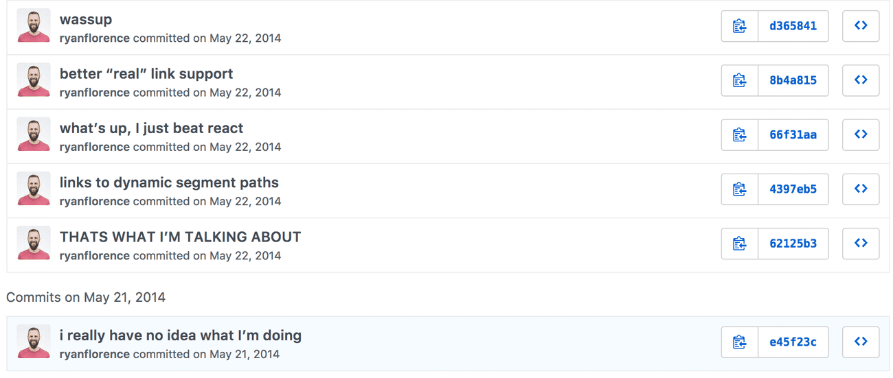

[toc]

### Introduction to React Router v4

> This is originally part of our React Router v4 course. However, it’s applicable to us here as well.

If you’ve been in React land for the last few years, you know that React Router has gone through a few different iterations. Say what you will, but it’s clear that the React Router we have today is a huge improvement on previous versions. The reason for these changes are pretty standard - the authors today are more experienced React developers than they were when React Router was first built. You see, back in 2014, **everyone** was new to React. React itself was still under a year old and no one really knew to what extent this whole component thing would play out. With that in mind, it’s natural that the first commits of React Router looked something like this.



At the time, the creators of React Router were coming from Ember backgrounds. So naturally, the first version of React Router was similar in nature to that of Ember’s router. That is, with both routers you’d establish your routes statically as part of the app’s initialization process. In fact, mostly all of the router’s you’re probably familiar with are used this way - Express, Angular, Ember, etc.

Here’s some code from an older version of React Router (v3). As you can see, you’d have a `routes.js` file where you’d establish your static routes.

```jsx
// routes.js

const routes = (
  <Router>
    <Route path='/' component={Main}>
      <IndexRoute component={Home} />
      <Route path='playerOne' component={Prompt} />
      <Route path='playerTwo/:playerOne' component={Prompt} />
      <Route path='battle' component={ConfirmBattle} />
      <Route path='results' component={Results} />
      <Route onEnter={checkAuth} path='dashboard' component={Dashboard} />
    </Route>
  </Router>
)

export default routes
```

Then, when you’d initialize your app, you’d import and render your routes.

```js
// index.js

import React from 'react'
import ReactDOM from 'react-dom'
import routes from './config/routes'

ReactDOM.render(routes, document.getElementById('app'))
```

This brings up the question, “is static routing bad?”. The answer to that is obviously no. However, one could argue it’s not really the “React way” of doing things. Since its creation, as the creators of React Router gained more experience, what they found was the original API behind React Router didn’t align with the mental model of React. Not only that but in some places React Router actually competed with the React API.

Looking back at the previous example, we pass an `onEnter` prop to the `<Route>` component.

```jsx
<Route
  onEnter={checkAuth}
  path='dashboard'
  component={Dashboard}
/>
```

The idea here is that before the user sees the `Dashboard` component, the `checkAuth` function verifies the user is authenticated. Well, doesn’t that sound similar to what should happen inside of `Dashboard`'s `componentDidMount` lifecycle hook? It is.

> With the original versions of React Router, it was more of a router for React rather than a true React router.

React Router v4 was built to fix these inconsistencies and work with React, rather than against it. If you’re already familiar with the benefits of React and the benefits of component composition, React Router v4 is going to make you feel at home - you just need to forget everything you know about traditional static routers.

Now the question is why is it that React Router v4 aligns nicely with React when previous versions fought against it? The answer is because it ditched static routing in favor of dynamic routing and the entire API is just components. What that means is that you declare your routes as part of your application just like you would any other component.

Let’s take a look at some code.

The goal here is to start out with some very basic code, then slowly add routing functionality to it. Here’s our starting code.

```jsx
import React from 'react'

class App extends React.Component {
  render() {
    return (
      <div>
        React Router Course
      </div>
    )
  }
}

export default App
```

As I mentioned earlier, React Router v4 is “just components”. So the first thing we’ll need to do is import the components we’ll need.

```js
import {
  BrowserRouter as Router,
  Route,
  Link,
} from 'react-router-dom'
```

A few things to note here. First, we’re importing `BrowserRouter` and renaming it `Router`. That’s not necessary, but it’s pretty common. What `BrowserRouter` does is it allows React Router to pass the app’s routing information down to any child component it needs (via context). So to make React Router work, you’ll need to render `BrowserRouter` at the root of your application.

```jsx
import React from 'react'
import {
  BrowserRouter as Router,
  Route,
  Link,
} from 'react-router-dom'

class App extends React.Component {
  render() {
    return (
      <Router>
        <div>
          React Router Course
        </div>
      </Router>
    )
  }
}

export default App
```

Next, we have `Route`. `Route` is both the backbone and the genius behind React Router v4. When the app’s location matches a certain path, `Route` will render a specified component, when it doesn’t, it will render null. So say, for example, we had a `Home` component that we wanted to render when our app was at the index path `/`. Our code would look something like this

```jsx
import React from 'react'
import {
  BrowserRouter as Router,
  Route,
  Link,
} from 'react-router-dom'

const Home = () => (
  <h2>Home</h2>
)

class App extends React.Component {
  render() {
    return (
      <Router>
        <div>
          <Route path='/' component={Home} />
        </div>
      </Router>
    )
  }
}

export default App
```

**[💻 Play with the code.](https://codesandbox.io/s/philosophy-1-f5bqy)**

With the code above, if we were at the index page (/), we would see the `Home` component. If we weren’t, we wouldn’t see anything (because `Route` would have rendered `null`).

------

Now, what if we wanted to add some more routes to our app? All we need to do is render more `Route` components.

```jsx
import React from 'react'
import {
  BrowserRouter as Router,
  Route,
  Link,
} from 'react-router-dom'

const Home = () => (
  <div>
    <h2>Home</h2>
  </div>
)

const About = () => (  <div>    <h2>About</h2>  </div>)
const Topics = () => (  <div>    <h2>Topics</h2>  </div>)
class App extends React.Component {
  render() {
    return (
      <Router>
        <div>
          <Route path='/' component={Home} />
          <Route path='/about' component={About} />          <Route path='/topics' component={Topics} />        </div>
      </Router>
    )
  }
}

export default App
```

**[💻 Play with the code.](https://codesandbox.io/s/philosophy-2-5i96y)**

Again, this may feel a little weird to your brain if you’re coming from static based routers since we’re literally rendering our routes. One thing that helped me was to remember `Route` is just a normal React component with a render method. That render method is either rendering the component or it’s rendering `null` depending on if the path matches. So when we render multiple `Route` components like we’re doing above, those will either render the component or render `null`.

So far, so good. One caveat that you might not have seen from the above code is that right now if you run the app and you head to the `/about` path, you’ll notice that both the `About` component and the `Home` component are rendered. This is because even though `/` doesn’t match the location exactly, it’s still considered a partial match so the `Home` component is rendered. To get around this, you need to add an `exact` prop to the `/` Route to specify that you only want it to match when the location matches exactly.

```jsx
<Route exact path='/' component={Home} />
```

**[💻 Play with the code.](https://codesandbox.io/s/philosophy-3-mxez1)**

Now that we’re dynamically rendering UI based on the app’s location, the next thing we need to do is have some way for the user to change the app’s location. This is where the `Link` component comes into play. It’s a simple component that allows the user to declaratively navigate around the app. Now, using `Link`, let’s add a simple navbar to our app.

```jsx
render() {
  return (
    <Router>
      <div>
        <ul>
          <li><Link to='/'>Home</Link></li>
          <li><Link to='/about'>About</Link></li>
          <li><Link to='/topics'>Topics</Link></li>
        </ul>

        <Route exact path='/' component={Home} />
        <Route path='/about' component={About} />
        <Route path='/topics' component={Topics} />
      </div>
    </Router>
  )
}
```

**[💻 Play with the code.](https://codesandbox.io/s/philosophy-4-9gx1e)**

At this point, we’ve covered the absolute fundamentals of React Router v4. We’re dynamically changing the UI based on the location by rendering a few different `Route` components and we’re able to change the location of our app by rendering a few different `Link` components. Let’s go a little deeper and talk about nested routes.

Nested routes were a fundamental aspect of previous versions of React Router and they continue to be today. The biggest difference is how you go about creating nested routes now compared to previous versions of React Router (<= v3). In previous, static versions, you’d nest routes in your route config. Because React Router v4 is all about dynamic routing, you can’t do that. However, in my opinion, nested routes with React Router v4 is much more intuitive than with previous, static versions. Again, the key is to forget what you knew previously.

Looking back at our example, what if we wanted the `Topics` component to render a nested navbar and some nested routes? The answer to that doesn’t need to be complicated. Just like you would nest a div, you can nest `Route`s.

```jsx
const Topic = () => (
  <div>
    <h3>TOPIC</h3>
  </div>
)

const Topics = () => (
  <div>
    <h2>Topics</h2>
    <ul>
      <li>
        <Link to={`/topics/rendering`}>
          Rendering with React
        </Link>
      </li>
      <li>
        <Link to={`/topics/components`}>
          Components
        </Link>
      </li>
      <li>
        <Link to={`/topics/props-v-state`}>
          Props v. State
        </Link>
      </li>
    </ul>

    <Route path={`/topics/rendering`} component={Topic} />
    <Route path={`/topics/components`} component={Topic} />
    <Route path={`/topics/props-v-state`} component={Topic} />
  </div>
)
```

**[💻 Play with the code.](https://codesandbox.io/s/philosophy-5-dsq87)**

Now when the user navigates to `/topics`, they’ll see a nested navbar and the UI will dynamically change - just like before - based on the location. The only difference is now we’re rendering the navbar and the `Route`s inside of another component, which is also being rendered by React Router.

You may have noticed that we hardcoded the URLs instead of dynamically creating them based on the current nested location we’re on.

```jsx
<Route path={`/topics/rendering`} component={Topic} />
<Route path={`/topics/components`} component={Topic} />
<Route path={`/topics/props-v-state`} component={Topic} />
```

When React Router renders a component, it passes that component three things: `match`, `location`, and `history`. In this example, what we want is `match.url` which will give us the current matched portion of the URL (in our example, `/topics`). So anywhere where we’re hard-coding `/topic`, we can replace with `match.url`.

```jsx
const Topics = ({ match }) => (
  <div>
    <h2>Topics</h2>
    <ul>
      <li>
        <Link to={`${match.url}/rendering`}>          Rendering with React
        </Link>
      </li>
      <li>
        <Link to={`${match.url}/components`}>          Components
        </Link>
      </li>
      <li>
        <Link to={`${match.url}/props-v-state`}>          Props v. State
        </Link>
      </li>
    </ul>

    <Route path={`${match.url}/rendering`} component={Topic} />    <Route path={`${match.url}/components`} component={Topic} />    <Route path={`${match.url}/props-v-state`} component={Topic} />  </div>
)
```

**[💻 Play with the code.](https://codesandbox.io/s/philosophy-6-2nmrn)**

Another thing you may have noticed is that we’re rendering three different `Route`s even though each are rendering the same component and the only difference is the nested URL.

```jsx
<Route path={`${match.url}/rendering`} component={Topic} />
<Route path={`${match.url}/components`} component={Topic} />
<Route path={`${match.url}/props-v-state`} component={Topic} />
```

This is the perfect use case for using URL parameters instead.

```jsx
const Topics = ({ match }) => (
  <div>
    ...

    <Route path={`${match.url}/:topicId`} component={Topic} />
  </div>
)
```

Now when React Router renders the `Topic` component, because we’re passed that `match` prop we talked about earlier, we’re also passed the `topicId` under `match.params`.

```jsx
const Topic = ({ match }) => (
  <div>
    <h3>{match.params.topicId}</h3>
  </div>
)
```

**[💻 Play with the code.](https://codesandbox.io/s/philosophy-7-7hcsk)**

Now, lastly, when we’re at the `/topics` route, if a topic hasn’t already been selected, we want to render some text that says “Please select a topic”. We can tell if a topic has been selected by looking at the URL. If the URL is exactly `/topics`, a topic hasn’t been selected. As we saw earlier, we can use the `exact` prop to tell React Router to only match if the `path` matches exactly.

> If you just want to render something inline without creating a component, you can use `Route`s `render` prop.

```jsx
<Route exact path={match.url} render={() => (
  <h3>Please select a topic.</h3>
)}/>
```

**[💻 Play with the code.](https://codesandbox.io/s/philosophy-8-ym037)**

That’s it! Our final code now looks like this,

```jsx
import React from 'react'
import {
  BrowserRouter as Router,
  Route,
  Link,
} from 'react-router-dom'

const Home = () => (
  <div>
    <h2>Home</h2>
  </div>
)

const About = () => (
  <div>
    <h2>About</h2>
  </div>
)

const Topic = ({ match }) => (
  <div>
    <h3>{match.params.topicId}</h3>
  </div>
)

const Topics = ({ match }) => (
  <div>
    <h2>Topics</h2>
    <ul>
      <li>
        <Link to={`${match.url}/rendering`}>
          Rendering with React
        </Link>
      </li>
      <li>
        <Link to={`${match.url}/components`}>
          Components
        </Link>
      </li>
      <li>
        <Link to={`${match.url}/props-v-state`}>
          Props v. State
        </Link>
      </li>
    </ul>

    <Route path={`${match.url}/:topicId`} component={Topic} />
    <Route exact path={match.url} render={() => (
      <h3>Please select a topic.</h3>
    )} />
  </div>
)

class App extends React.Component {
  render() {
    return (
      <Router>
        <div>
          <ul>
            <li><Link to='/'>Home</Link></li>
            <li><Link to='/about'>About</Link></li>
            <li><Link to='/topics'>Topics</Link></li>
          </ul>

          <Route exact path='/' component={Home} />
          <Route path='/about' component={About} />
          <Route path='/topics' component={Topics} />
        </div>
      </Router>
    )
  }
}

export default App
```

**[💻 Play with the code.](https://codesandbox.io/s/philosophy-8-ym037)**

------

By utilizing a component-based API, React Router v4 truly is a React router. I believe React will make you a better JavaScript developer and React Router v4 will make you a better React developer.


### React Router v4 Query Strings

> This is originally part of our React Router v4 course. However, it’s applicable to us here as well.

When you’re building for the web, sometimes you need to pass information via the URL. To do this, you can use a query string.

You’ve probably seen them before IRL. Here’s an example from Twitter’s analytics page.


This URL has three route parameters and two query strings. Twitter is using query strings to tell its route to `filter` the Tweets by `top` (most popular) and that the `origin` was `im` (which I’m not sure what that means, TBH).

With that said, odds are you’re not here to learn **what** query strings are but instead **how** to use them with React Router v4. The good news is that if you’re already comfortable with React Router v4, there are just a few small details you need to know.

Let’s say we were Twitter and we were building the `Route` for the URL above. It would probably look something like this.

```jsx
<Route
  path={`${match.path}/tweets`}
  component={Tweets}
/>
```

Notice at this point there’s nothing new. We don’t account for the query string when we create the `Route`. Instead, we parse them inside the component that is being rendered when that path matches - in this case, `Tweets`.

Now the question becomes, how do we actually do this?

If you poke around on the `location` object that is passed to all components rendered by React Router v4, you’ll notice that it has a search property on it.

```js
componentDidMount() {
  console.log(this.props.location.search) // "?filter=top&origin=im"
}
```

Cool, but this is the literal query **string**. You’ll need to somehow parse it before you can get the actual values.

You may be surprised to hear that React Router v4 doesn’t come with built-in with support for parsing query strings. The reason for this is because, over the years, there have been many requests to support different implementations. With that, the team decided it would be best for users to decide what the implementation looks like rather than baking in a “one size fits all” solution. Regardless, what that means is that you’ll need to bring your own query-string parser.

There are two common solutions. Either use a [browser API](https://developer.mozilla.org/en-US/docs/Web/API/URLSearchParams) (that may not be supported by all the browsers you need) or use an external library for parsing the query string. The library I typically use is the [query-string](https://www.npmjs.com/package/query-string) library on NPM.

With that library installed, all we need to do is call `queryString.parse` passing in our `location.search`. That will parse the query string into an object which we can then grab the values off of.

```js
import queryString from 'query-string'

...

componentDidMount() {
  const values = queryString.parse(this.props.location.search)
  console.log(values.filter) // "top"
  console.log(values.origin) // "im"
}
```

That’s it. Go parse those query strings.


### 404 with React Router v4

> This is originally part of our React Router v4 course. However, it’s applicable to us here as well.

A common use case for when you’re building a web app is to have a “catch all” route that will be rendered if none of your other routes match. A common example of this would be a 404 page.

To see how this works with React Router v4, let’s first render a navbar with the following paths - `/`, `/will-match`, `/will-not-match`, and `/also/will/not/match`.

```jsx
import React from 'react'
import {
  BrowserRouter as Router,
  Route,
  Link
} from 'react-router-dom'

class App extends React.Component {
  render() {
    return (
      <Router>
        <div>
          <ul>
            <li><Link to="/">Home</Link></li>
            <li><Link to="/will-match">Will Match</Link></li>
            <li><Link to="/will-not-match">Will Not Match</Link></li>
            <li><Link to="/also/will/not/match">Also Will Not Match</Link></li>
          </ul>
        </div>
      </Router>
    )
  }
}

export default App
```

**[💻 Play with the code.](https://codesandbox.io/s/catch-all-1-cplmi)**

Now that we have the navbar set up, let’s create three different components to render - `Home`, which will match on `/`, `WillMatch` which will match on `/will-match`, and `NoMatch`, which will be the catch-all component which will render only if none of the other `Route`'s match.

```jsx
const Home = () => <h1>Home</h1>

const WillMatch = () => <h3>Matched!</h3>

const NoMatch = ({ location }) => (
  <h3>No match for <code>{location.pathname}</code></h3>
)
```

**[💻 Play with the code.](https://codesandbox.io/s/catch-all-2-xqeim)**

Now that we have the components which are going to be rendered, we need to actually render some `Route`s. `Home` and `WillMatch` are straight forward, you just render them as you normally would.

```jsx
render() {
  return (
    <Router>
      <div>
        <ul>
          <li><Link to="/">Home</Link></li>
          <li><Link to="/will-match">Will Match</Link></li>
          <li><Link to="/will-not-match">Will Not Match</Link></li>
          <li><Link to="/also/will/not/match">Also Will Not Match</Link></li>
        </ul>

        <Route path="/" exact component={Home}/>        <Route path="/will-match" component={WillMatch}/>      </div>
    </Router>
  )
}
```

**[💻 Play with the code.](https://codesandbox.io/s/catch-all-3-j8yq2)**

Now the question becomes, how do we render `NoMatch`? Remember, we only want to render `NoMatch` if both the `/` and `/will-match` `Route`s don’t match. There are two parts to accomplishing this - the first is that if you render a `Route` but don’t specify a `path` prop, that route will always match and render the `component`. Let’s do that for our `NoMatch` component.

```jsx
<Route path="/" exact component={Home}/>
<Route path="/will-match" component={WillMatch}/>
<Route component={NoMatch} />
```

**[💻 Play with the code.](https://codesandbox.io/s/catch-all-4-t1uh1)**

That’s closer, but if you play around with the app, you know we’re not done yet. Now the app renders the `Home` and `WillMatch` components properly but it also always renders the `NoMatch` component no matter what path we’re on.

What we need is a way to tell React Router v4 that we only want to render the first `Route` that matches - even if there’s more than one match. By doing this, our `NoMatch` component will only get rendered if the two `Route`s above it, `/` and `/will-match` aren’t matched.

The good news is React Router v4 comes with a component that does exactly this and it’s called `Switch`. By wrapping your `Route`s inside of `Switch`, React Router will only render the **first** `Route` that matches.

```jsx
render() {
  return (
    <Router>
      <div>
        <ul>
          <li><Link to="/">Home</Link></li>
          <li><Link to="/will-match">Will Match</Link></li>
          <li><Link to="/will-not-match">Will Not Match</Link></li>
          <li><Link to="/also/will/not/match">Also Will Not Match</Link></li>
        </ul>

        <Switch>          <Route path="/" exact component={Home}/>          <Route path="/will-match" component={WillMatch}/>          <Route component={NoMatch} />        </Switch>      </div>
    </Router>
  )
}
```

**[💻 Play with the code.](https://codesandbox.io/s/catch-all-5-1tzdp)**

Now if the user isn’t at `/` or `/will-match`, the `NoMatch` component will be rendered.

You can utilize this same pattern to render a client-side 404 page if none of your other `Route`s match.

```jsx
<Switch>
  <Route exact path="/" component={Home}/>
  <Route exact path="/profile" component={Profile}/>
  <Route component={FourZeroFour} />
</Switch>
```