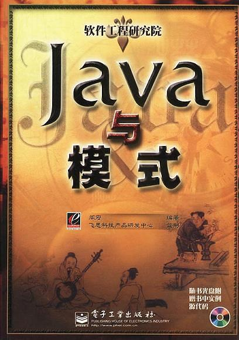
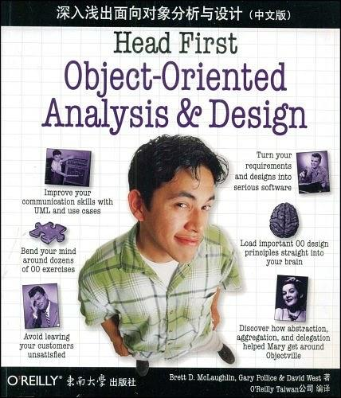
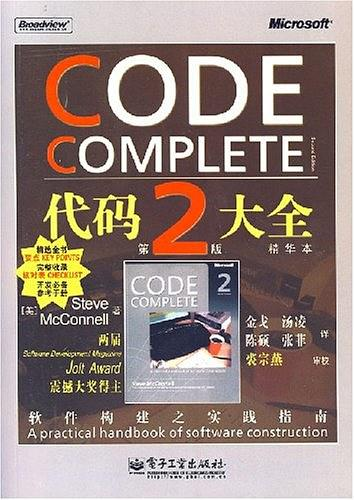
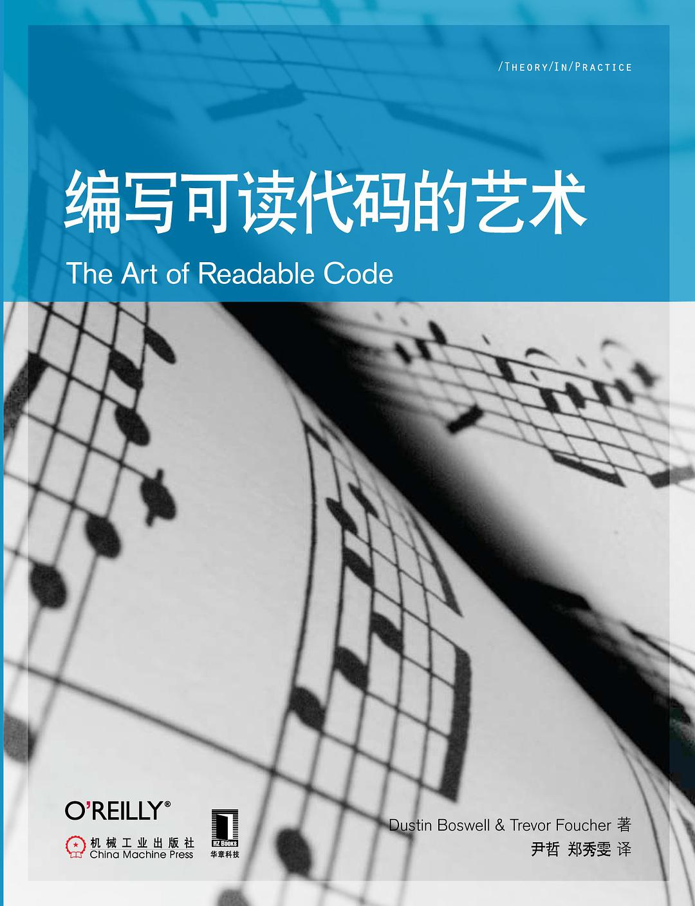
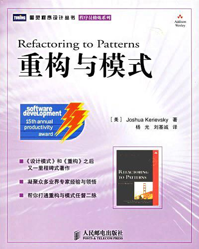
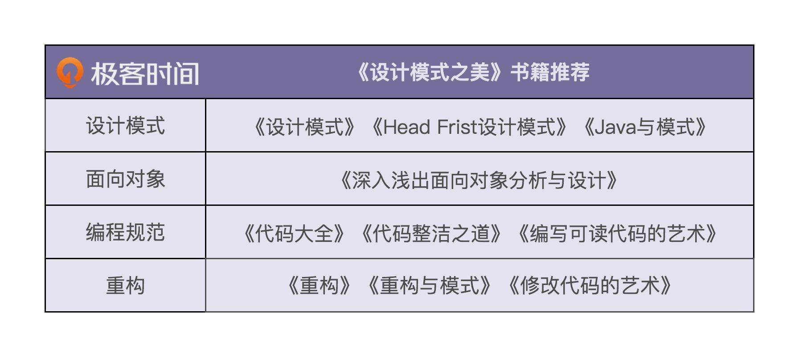

# 加餐二 | 设计模式、重构、编程规范等相关书籍推荐

1.《设计模式》

2.《Head First 设计模式》

3.《Java 与模式》

4.《深入浅出面向对象分析与设计》

5.《代码大全》

6.《代码整洁之道》

7.《编写可读代码的艺术》

《代码整洁之道》《代码大全》《编写可读代码的艺术》三本书是讲编码规范方面的三大著作。看完这三本书，基本的编码规范你就掌握全了。

8.《重构》

9.《重构与模式》

10.《修改代码的艺术》

总结

